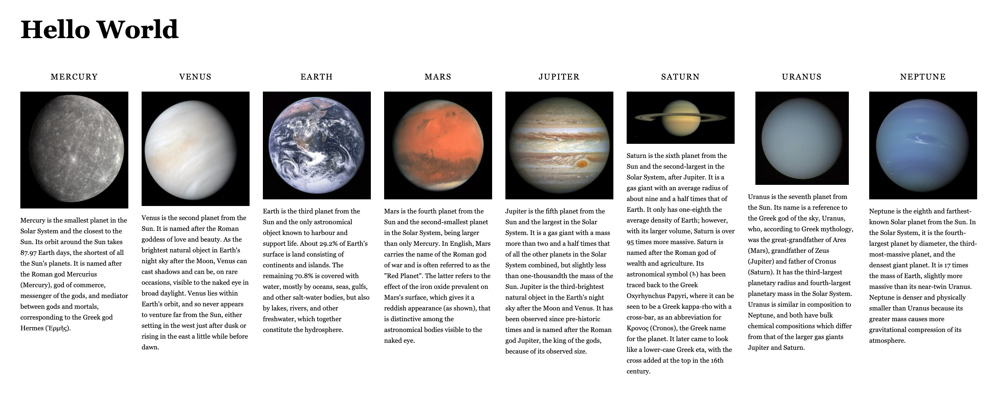

# Example with Tailwind and HTML

This is an example of a HTML project using Tailwind CSS framework.

Just open `index.html` with your favourite browser to see it!

## Resources

- [HTML boilerplate](https://www.freecodecamp.org/news/basic-html5-template-boilerplate-code-example)
- [Tailwind](https://tailwindui.com/)
  - [Setup](https://tailwindcss.com/docs/installation#using-tailwind-via-cdn)
  - [Docs](https://tailwindcss.com/docs)
